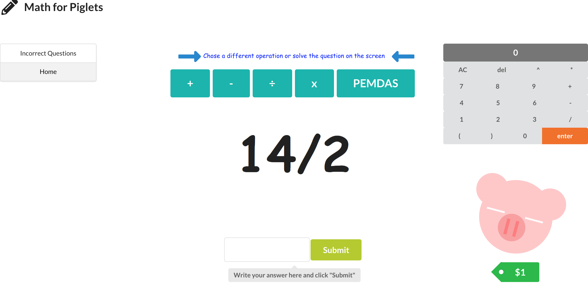

# Math for Piglets

*Math for Piglets*, a math-learning application with a built-in reward system, directed towards children.

## Video Demo
https://drive.google.com/file/d/1Fxe3j8lOhi2zBB8e-EjaLbM-3HAPdEEI/view

## Application Features
- User can choose a math operation and solve the given question.

- User can return to questions answered incorrectly.

- User can earn money for their virtual piggy bank for each correct question.

- User can use the built-in calculator to solve equations.

## Built With
- React
- Ruby
- Rails API utilizing Active Model Serializers
- Sqlite3 Database using ActiveRecord
- Math.js library

## Back-End Repository
https://github.com/bryanteng/math_for_piglets_backend

## Server-Side Install Instructions
1. Run `bundle install`
2. Run `rake db:create`
3. Run `rake db:migrate`
4. Run `rake db:seed`
5. Run `rails s -p 3000`

## Client-Side Install Instructions
1. Run `npm install`
2. Run `npm start`

## Contributing
[Contributing Guide](./CONTRIBUTING.md)

## Authors
- **Scarlett Perry**
- **Bryan Teng**

## License
[License](./LICENSE.md)

## Acknowledgments
- Big thank you to Tony Lam & Eric Kim
